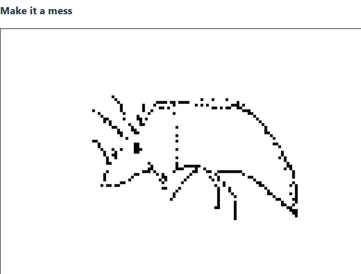

# Collaborative Whiteboard (P2P / WebRTC)

Roadmap

## Phase 1 : Minimal Local Drawing Board
React + Canvas API
[x] Feature : save png after each pixel is drawn
[x] Bug : departure point when drawing line is not okay

## Phase 2 : Loacal Network Sync with Websockets
# FastAPI or Websockets
[ ] Read about these technologies

Here we would like to use a central server that broadcast realtime state of the canvas to all the cient (test it with different tabs in our case)

## Phase 3 : P2P upgrade with WebRTC
WebRTC
direct P2P information sharing, we would like to get rid of the central server used by websockets

## Phase 4 : Persistence and features
- change of Color
- change of square Size

## Phase 5 : Polish and Fun
- login system
- see where othe user are
