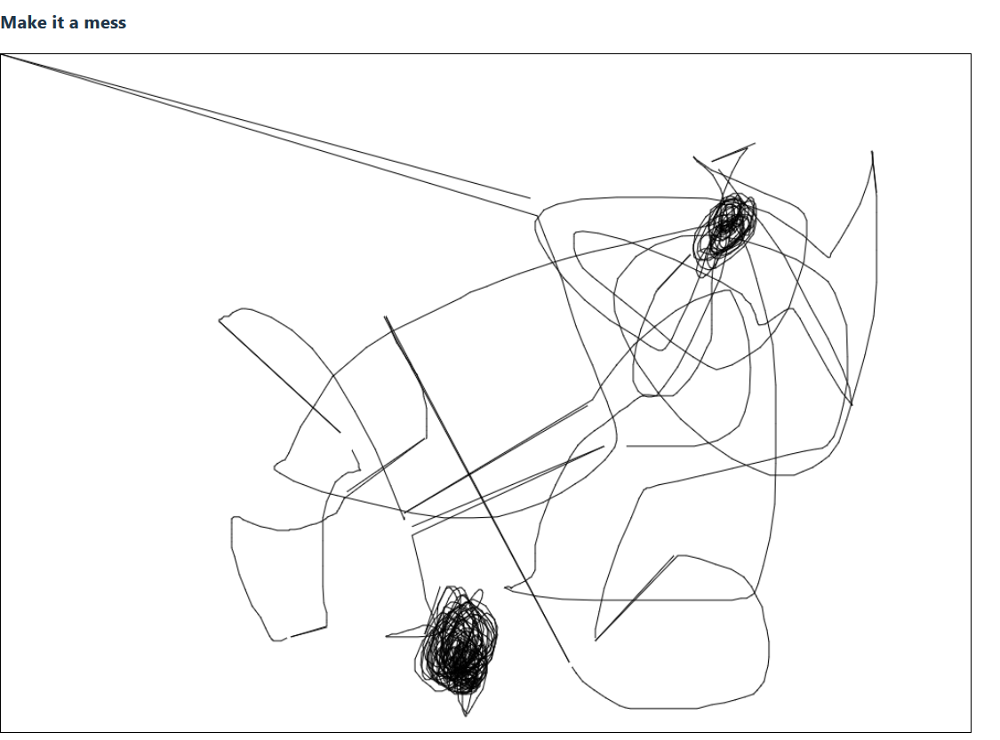

# Collaborative Whiteboard (P2P / WebRTC)

Roadmap

## Phase 1 : Minimal Local Drawing Board
React + Canvas API
[x] Feature : save png after each pixel is drawn
[x] Bug : departure point when drawing line is not okay

## Phase 2 : Loacal Network Sync with Websockets
FastAPI or Websockets
[ ] Read about these technologies
## Phase 3 : P2P upgrade with WebRTC
WebRTC

## Phase 4 : Persistence and features

## Phase 5 : Polish and Fun
